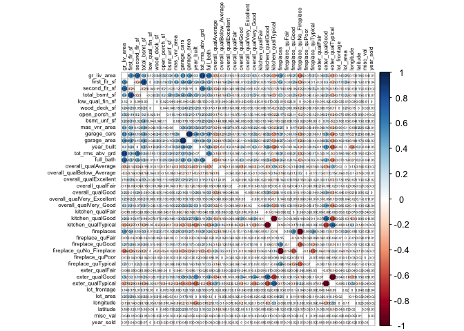
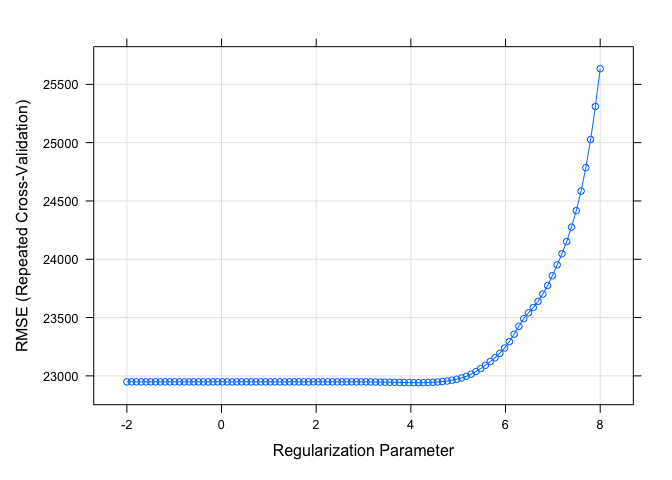
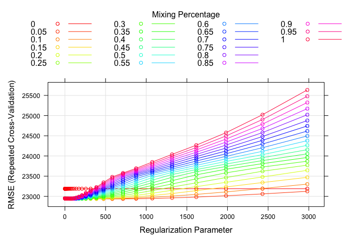
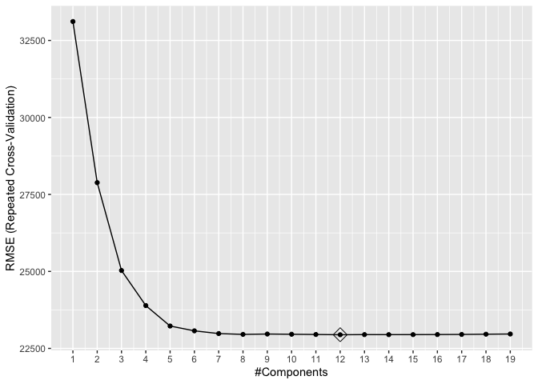
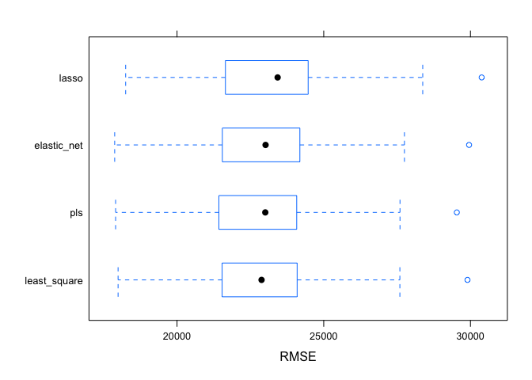

P8106 HW1
================
Cary Ni
2023-02-09

# Prediction of sales prices of houses

``` r
# load the datasets for model building
training_df = read_csv("housing_training.csv") %>% 
  janitor::clean_names() %>% 
  na.omit()
```

    ## Rows: 1440 Columns: 26
    ## ── Column specification ────────────────────────────────────────────────────────
    ## Delimiter: ","
    ## chr  (4): Overall_Qual, Kitchen_Qual, Fireplace_Qu, Exter_Qual
    ## dbl (22): Gr_Liv_Area, First_Flr_SF, Second_Flr_SF, Total_Bsmt_SF, Low_Qual_...
    ## 
    ## ℹ Use `spec()` to retrieve the full column specification for this data.
    ## ℹ Specify the column types or set `show_col_types = FALSE` to quiet this message.

``` r
test_df = read_csv("housing_test.csv") %>% 
  janitor::clean_names() %>% 
  na.omit()
```

    ## Rows: 959 Columns: 26
    ## ── Column specification ────────────────────────────────────────────────────────
    ## Delimiter: ","
    ## chr  (4): Overall_Qual, Kitchen_Qual, Fireplace_Qu, Exter_Qual
    ## dbl (22): Gr_Liv_Area, First_Flr_SF, Second_Flr_SF, Total_Bsmt_SF, Low_Qual_...
    ## 
    ## ℹ Use `spec()` to retrieve the full column specification for this data.
    ## ℹ Specify the column types or set `show_col_types = FALSE` to quiet this message.

``` r
# create covariates matrix for training and test
predictors = model.matrix(sale_price ~ ., data = training_df)[,-1]
predictors_test = model.matrix(sale_price ~ ., data = test_df)[,-1]
# create response vector for training and test
response = training_df %>% pull(sale_price)
response_test = test_df %>% pull(sale_price)

# create a quick function to calculate test mse
get_test_mse = function(input_model, x_test, y_test) {
  predict_value = predict(input_model, newdata = x_test)
  test_mse = mean((predict_value - y_test)^2)
  return(test_mse)
}
```

## Correlation plot to check collinearity between covariates (based on training data)

``` r
cor(predictors) %>% corrplot(
  method = "circle", type = "full", 
  addCoef.col = 1, number.font =0.5,
  tl.col="black", tl.srt=90, tl.cex = 0.5,
  insig = "blank", diag=FALSE, number.cex = .3)
```

<!-- -->

It can be seen from the correlation plot that some are the covariates
have high correlation coefficients to each to other, which leads to the
issue of collinearity. In order to remedy for the potential
multicollinearity among covariates, regularization methods such as
lasso, elastic net, and partial least squares are used to are used to
minimize the influence brought by collinearity.

## Linear least squared model

``` r
# set cross validation methods used in train object
ctrl_1 = trainControl(method = "repeatedcv", number = 10, repeats = 5)

set.seed(1)
# build the linear least squared model with caret
lm_model = train(predictors, response, method = "lm", trControl = ctrl_1)
summary(lm_model)
```

    ## 
    ## Call:
    ## lm(formula = .outcome ~ ., data = dat)
    ## 
    ## Residuals:
    ##    Min     1Q Median     3Q    Max 
    ## -89864 -12424    416  12143 140205 
    ## 
    ## Coefficients: (1 not defined because of singularities)
    ##                              Estimate Std. Error t value Pr(>|t|)    
    ## (Intercept)                -4.985e+06  3.035e+06  -1.642  0.10076    
    ## gr_liv_area                 2.458e+01  1.393e+01   1.765  0.07778 .  
    ## first_flr_sf                4.252e+01  1.409e+01   3.017  0.00260 ** 
    ## second_flr_sf               4.177e+01  1.379e+01   3.029  0.00250 ** 
    ## total_bsmt_sf               3.519e+01  2.744e+00  12.827  < 2e-16 ***
    ## low_qual_fin_sf                    NA         NA      NA       NA    
    ## wood_deck_sf                1.202e+01  4.861e+00   2.474  0.01350 *  
    ## open_porch_sf               1.618e+01  1.004e+01   1.611  0.10736    
    ## bsmt_unf_sf                -2.087e+01  1.723e+00 -12.116  < 2e-16 ***
    ## mas_vnr_area                1.046e+01  4.229e+00   2.473  0.01353 *  
    ## garage_cars                 4.229e+03  1.893e+03   2.234  0.02563 *  
    ## garage_area                 7.769e+00  6.497e+00   1.196  0.23195    
    ## year_built                  3.251e+02  3.130e+01  10.388  < 2e-16 ***
    ## tot_rms_abv_grd            -3.838e+03  6.922e+02  -5.545 3.51e-08 ***
    ## full_bath                  -4.341e+03  1.655e+03  -2.622  0.00883 ** 
    ## overall_qualAverage        -5.013e+03  1.735e+03  -2.890  0.00391 ** 
    ## overall_qualBelow_Average  -1.280e+04  2.677e+03  -4.782 1.92e-06 ***
    ## overall_qualExcellent       7.261e+04  5.381e+03  13.494  < 2e-16 ***
    ## overall_qualFair           -1.115e+04  5.240e+03  -2.127  0.03356 *  
    ## overall_qualGood            1.226e+04  1.950e+03   6.287 4.30e-10 ***
    ## overall_qualVery_Excellent  1.304e+05  8.803e+03  14.810  < 2e-16 ***
    ## overall_qualVery_Good       3.798e+04  2.741e+03  13.852  < 2e-16 ***
    ## kitchen_qualFair           -2.663e+04  6.325e+03  -4.210 2.71e-05 ***
    ## kitchen_qualGood           -1.879e+04  4.100e+03  -4.582 5.01e-06 ***
    ## kitchen_qualTypical        -2.677e+04  4.281e+03  -6.252 5.37e-10 ***
    ## fireplaces                  1.138e+04  2.257e+03   5.043 5.18e-07 ***
    ## fireplace_quFair           -7.207e+03  6.823e+03  -1.056  0.29106    
    ## fireplace_quGood            6.070e+02  5.833e+03   0.104  0.91713    
    ## fireplace_quNo_Fireplace    3.394e+03  6.298e+03   0.539  0.59002    
    ## fireplace_quPoor           -5.185e+03  7.399e+03  -0.701  0.48362    
    ## fireplace_quTypical        -6.398e+03  5.897e+03  -1.085  0.27814    
    ## exter_qualFair             -3.854e+04  8.383e+03  -4.598 4.66e-06 ***
    ## exter_qualGood             -1.994e+04  5.585e+03  -3.569  0.00037 ***
    ## exter_qualTypical          -2.436e+04  5.874e+03  -4.147 3.57e-05 ***
    ## lot_frontage                1.024e+02  1.905e+01   5.376 8.90e-08 ***
    ## lot_area                    6.042e-01  7.864e-02   7.683 2.91e-14 ***
    ## longitude                  -3.481e+04  2.537e+04  -1.372  0.17016    
    ## latitude                    5.874e+04  3.483e+04   1.686  0.09193 .  
    ## misc_val                    9.171e-01  1.003e+00   0.914  0.36071    
    ## year_sold                  -6.455e+02  4.606e+02  -1.401  0.16132    
    ## ---
    ## Signif. codes:  0 '***' 0.001 '**' 0.01 '*' 0.05 '.' 0.1 ' ' 1
    ## 
    ## Residual standard error: 22190 on 1401 degrees of freedom
    ## Multiple R-squared:  0.9116, Adjusted R-squared:  0.9092 
    ## F-statistic: 380.3 on 38 and 1401 DF,  p-value: < 2.2e-16

``` r
# get test mse of linear least squared model
get_test_mse(lm_model, predictors_test, response_test)
```

    ## [1] 447287652

The least squared model has 38 variables shown above.

## Lasso model based on lambda.min

``` r
set.seed(1)
# build lasso model based on lambda.min
lasso_model_1 = train(predictors, response, 
                    method = "glmnet",
                    tuneGrid = expand.grid(alpha = 1,
                                           lambda = exp(seq(-2, 8, length=100))),
                    trControl = ctrl_1)
plot(lasso_model_1, xTrans = log)
```

<!-- -->

``` r
# show the best lambda with lowest cv rmse
lasso_model_1$bestTune
```

    ##    alpha   lambda
    ## 62     1 64.17516

``` r
# show coefficients of best model based on lambda min
coef(lasso_model_1$finalModel, lasso_model_1$bestTune$lambda)
```

    ## 40 x 1 sparse Matrix of class "dgCMatrix"
    ##                                       s1
    ## (Intercept)                -4.830346e+06
    ## gr_liv_area                 6.540238e+01
    ## first_flr_sf                8.016798e-01
    ## second_flr_sf               .           
    ## total_bsmt_sf               3.541418e+01
    ## low_qual_fin_sf            -4.095881e+01
    ## wood_deck_sf                1.164153e+01
    ## open_porch_sf               1.544655e+01
    ## bsmt_unf_sf                -2.088792e+01
    ## mas_vnr_area                1.089192e+01
    ## garage_cars                 4.086270e+03
    ## garage_area                 8.161397e+00
    ## year_built                  3.233663e+02
    ## tot_rms_abv_grd            -3.620617e+03
    ## full_bath                  -3.849455e+03
    ## overall_qualAverage        -4.856601e+03
    ## overall_qualBelow_Average  -1.246350e+04
    ## overall_qualExcellent       7.545290e+04
    ## overall_qualFair           -1.075910e+04
    ## overall_qualGood            1.212418e+04
    ## overall_qualVery_Excellent  1.356218e+05
    ## overall_qualVery_Good       3.789366e+04
    ## kitchen_qualFair           -2.487155e+04
    ## kitchen_qualGood           -1.723010e+04
    ## kitchen_qualTypical        -2.533814e+04
    ## fireplaces                  1.055908e+04
    ## fireplace_quFair           -7.669876e+03
    ## fireplace_quGood            .           
    ## fireplace_quNo_Fireplace    1.462970e+03
    ## fireplace_quPoor           -5.644087e+03
    ## fireplace_quTypical        -7.011684e+03
    ## exter_qualFair             -3.340938e+04
    ## exter_qualGood             -1.515968e+04
    ## exter_qualTypical          -1.959557e+04
    ## lot_frontage                9.969303e+01
    ## lot_area                    6.042705e-01
    ## longitude                  -3.296544e+04
    ## latitude                    5.514849e+04
    ## misc_val                    8.297428e-01
    ## year_sold                  -5.617527e+02

``` r
# get test mse of lasso model based on lambda.min
get_test_mse(lasso_model_1, predictors_test, response_test)
```

    ## [1] 440092572

``` r
# show number of predictors (excluding intercept)
num_coff = coef(lasso_model_1$finalModel, lasso_model_1$bestTune$lambda) 
sum(num_coff != 0) - 1
```

    ## [1] 37

### Lasso model based on 1se rule

``` r
# build lasso model based on lambda.1se
ctrl_2 = trainControl(method = "repeatedcv", selectionFunction = "oneSE",
                      number = 10, repeats = 5)
set.seed(1)
lasso_model_2 = train(predictors, response, 
                    method = "glmnet",
                    tuneGrid = expand.grid(alpha = 1,
                                           lambda = exp(seq(-2, 8, length=100))),
                    trControl = ctrl_2)
# show the best lambda based on 1se rule
lasso_model_2$bestTune
```

    ##    alpha   lambda
    ## 80     1 395.3605

``` r
# show coefficients of best model based on 1se
coef(lasso_model_2$finalModel, lasso_model_2$bestTune$lambda)
```

    ## 40 x 1 sparse Matrix of class "dgCMatrix"
    ##                                       s1
    ## (Intercept)                -3.943441e+06
    ## gr_liv_area                 6.108086e+01
    ## first_flr_sf                9.449637e-01
    ## second_flr_sf               .           
    ## total_bsmt_sf               3.625951e+01
    ## low_qual_fin_sf            -3.544140e+01
    ## wood_deck_sf                1.004751e+01
    ## open_porch_sf               1.213017e+01
    ## bsmt_unf_sf                -2.060701e+01
    ## mas_vnr_area                1.293690e+01
    ## garage_cars                 3.503770e+03
    ## garage_area                 9.711868e+00
    ## year_built                  3.152712e+02
    ## tot_rms_abv_grd            -2.541684e+03
    ## full_bath                  -1.469004e+03
    ## overall_qualAverage        -4.028703e+03
    ## overall_qualBelow_Average  -1.088208e+04
    ## overall_qualExcellent       8.701702e+04
    ## overall_qualFair           -8.812993e+03
    ## overall_qualGood            1.113742e+04
    ## overall_qualVery_Excellent  1.557578e+05
    ## overall_qualVery_Good       3.731931e+04
    ## kitchen_qualFair           -1.452506e+04
    ## kitchen_qualGood           -7.943206e+03
    ## kitchen_qualTypical        -1.672289e+04
    ## fireplaces                  8.251261e+03
    ## fireplace_quFair           -3.942182e+03
    ## fireplace_quGood            2.111321e+03
    ## fireplace_quNo_Fireplace    .           
    ## fireplace_quPoor           -1.621801e+03
    ## fireplace_quTypical        -4.236539e+03
    ## exter_qualFair             -1.699637e+04
    ## exter_qualGood              .           
    ## exter_qualTypical          -4.789838e+03
    ## lot_frontage                8.694872e+01
    ## lot_area                    5.920132e-01
    ## longitude                  -2.270960e+04
    ## latitude                    3.807773e+04
    ## misc_val                    3.236657e-01
    ## year_sold                  -1.732609e+02

``` r
# get test mse of lasso model based on 1se
get_test_mse(lasso_model_2, predictors_test, response_test)
```

    ## [1] 420909622

``` r
# show number of predictors (excluding intercept)
num_coff_2 = coef(lasso_model_2$finalModel, lasso_model_2$bestTune$lambda) 
sum(num_coff_2 != 0) - 1
```

    ## [1] 36

It can be seen that lambda.min generate a model with 37 predictors while
1se rule reduces number of predictors to 36.The selected lambda for
lowest cv rmse is 62.89 while the 1se rule gives lambda of 372.1. Since
the lasso model based on 1se rule has smaller test mse which is 4.21e8
than lambda.min which is 4.40e8, the lasso model based on 1se is
favored.

## Elastic net model

``` r
set.seed(1)
# build elastic net model with caret
elnet_model = train(predictors, response, 
                    method = "glmnet",
                    tuneGrid = expand.grid(alpha = seq(0, 1, length=21),
                                           lambda = exp(seq(-2, 8, length=50))),
                    trControl = ctrl_1)
myCol<- rainbow(21)
myPar <- list(superpose.symbol = list(col = myCol),
superpose.line = list(col = myCol))
plot(elnet_model, par.settings = myPar)
```

<!-- -->

``` r
# show the best lambda and alpha combination with lowest cv rmse
elnet_model$bestTune
```

    ##    alpha   lambda
    ## 92  0.05 582.5103

``` r
# show coefficients of best model
coef(elnet_model$finalModel, elnet_model$bestTune$lambda)
```

    ## 40 x 1 sparse Matrix of class "dgCMatrix"
    ##                                       s1
    ## (Intercept)                -5.112549e+06
    ## gr_liv_area                 3.877324e+01
    ## first_flr_sf                2.669846e+01
    ## second_flr_sf               2.545218e+01
    ## total_bsmt_sf               3.494244e+01
    ## low_qual_fin_sf            -1.586458e+01
    ## wood_deck_sf                1.232562e+01
    ## open_porch_sf               1.688120e+01
    ## bsmt_unf_sf                -2.072755e+01
    ## mas_vnr_area                1.165596e+01
    ## garage_cars                 4.046453e+03
    ## garage_area                 8.893308e+00
    ## year_built                  3.191927e+02
    ## tot_rms_abv_grd            -3.440136e+03
    ## full_bath                  -3.692753e+03
    ## overall_qualAverage        -5.116812e+03
    ## overall_qualBelow_Average  -1.270813e+04
    ## overall_qualExcellent       7.582763e+04
    ## overall_qualFair           -1.147347e+04
    ## overall_qualGood            1.198272e+04
    ## overall_qualVery_Excellent  1.363894e+05
    ## overall_qualVery_Good       3.765814e+04
    ## kitchen_qualFair           -2.368649e+04
    ## kitchen_qualGood           -1.610599e+04
    ## kitchen_qualTypical        -2.415667e+04
    ## fireplaces                  1.082895e+04
    ## fireplace_quFair           -7.857833e+03
    ## fireplace_quGood            1.486635e+02
    ## fireplace_quNo_Fireplace    1.819327e+03
    ## fireplace_quPoor           -5.804038e+03
    ## fireplace_quTypical        -6.962451e+03
    ## exter_qualFair             -3.296303e+04
    ## exter_qualGood             -1.455999e+04
    ## exter_qualTypical          -1.915475e+04
    ## lot_frontage                1.001690e+02
    ## lot_area                    6.032320e-01
    ## longitude                  -3.515266e+04
    ## latitude                    5.775817e+04
    ## misc_val                    8.684001e-01
    ## year_sold                  -5.747735e+02

``` r
# get test mse of the elastic net model
get_test_mse(elnet_model, predictors_test, response_test)
```

    ## [1] 438591167

### Try Elastic net model with 1se

``` r
set.seed(1)
elnet_model_2 = train(predictors, response, 
                    method = "glmnet",
                    tuneGrid = expand.grid(alpha = seq(0, 1, length=21),
                                           lambda = exp(seq(-2, 8, length=50))),
                    trControl = ctrl_2)
elnet_model_2$bestTune
```

    ##    alpha   lambda
    ## 50     0 2980.958

``` r
# show coefficients of best model
coef(elnet_model_2$finalModel, elnet_model_2$bestTune$lambda)
```

    ## 40 x 1 sparse Matrix of class "dgCMatrix"
    ##                                       s1
    ## (Intercept)                -6.335390e+06
    ## gr_liv_area                 3.239590e+01
    ## first_flr_sf                2.625217e+01
    ## second_flr_sf               2.206668e+01
    ## total_bsmt_sf               3.197020e+01
    ## low_qual_fin_sf            -1.786580e+01
    ## wood_deck_sf                1.581469e+01
    ## open_porch_sf               2.360529e+01
    ## bsmt_unf_sf                -1.879961e+01
    ## mas_vnr_area                1.765883e+01
    ## garage_cars                 3.835315e+03
    ## garage_area                 1.380900e+01
    ## year_built                  2.840685e+02
    ## tot_rms_abv_grd            -1.777713e+03
    ## full_bath                  -1.514764e+03
    ## overall_qualAverage        -5.989414e+03
    ## overall_qualBelow_Average  -1.282769e+04
    ## overall_qualExcellent       7.581098e+04
    ## overall_qualFair           -1.422795e+04
    ## overall_qualGood            9.779199e+03
    ## overall_qualVery_Excellent  1.397774e+05
    ## overall_qualVery_Good       3.386129e+04
    ## kitchen_qualFair           -1.663421e+04
    ## kitchen_qualGood           -9.438848e+03
    ## kitchen_qualTypical        -1.770321e+04
    ## fireplaces                  9.919400e+03
    ## fireplace_quFair           -7.656381e+03
    ## fireplace_quGood            1.644805e+03
    ## fireplace_quNo_Fireplace    3.759105e+02
    ## fireplace_quPoor           -5.682051e+03
    ## fireplace_quTypical        -5.611492e+03
    ## exter_qualFair             -2.585950e+04
    ## exter_qualGood             -6.657289e+03
    ## exter_qualTypical          -1.321177e+04
    ## lot_frontage                9.486833e+01
    ## lot_area                    5.855032e-01
    ## longitude                  -4.434608e+04
    ## latitude                    6.263526e+04
    ## misc_val                    8.342702e-01
    ## year_sold                  -4.693104e+02

The selected elastic net model with lowest cv rmse has best alpha = 0.05
and lambda = 582.5 shown above. The test mse of the model is 4.39e8.
When 1se lambda is applied in this elastic net model, the best alpha
becomes 0 and lambda is the largest value in the tuneGrid set (2980.96
in this case). It suggests that it becomes ridge regression and none of
the parameters shrink to zero and fails to simplify the model.
Therefore, applying 1se rule is not practical in selecting tuning
parameters in this case.

## Partial least squares model

``` r
set.seed(1)
pls_model = train(predictors, response,
                method = "pls",
                tuneGrid = data.frame(ncomp = 1:19),
                trControl = ctrl_1,
                preProcess = c("center", "scale"))
ggplot(pls_model, highlight = TRUE) + 
  scale_x_continuous(breaks = seq(0,20,by=1))
```

<!-- -->

``` r
# get test mse of the Partial least squares model
get_test_mse(pls_model, predictors_test, response_test)
```

    ## [1] 449622718

It can shown that 12 components are included in the partial least
squares model with lowest cv rmse. The test mse is 4.50e8.

## Compare the performance of models above

``` r
# compare the model performance through resample method
resamp = resamples(
  list(
    least_square = lm_model,
    lasso = lasso_model_2,
    elastic_net = elnet_model,
    pls = pls_model))
summary(resamp)
```

    ## 
    ## Call:
    ## summary.resamples(object = resamp)
    ## 
    ## Models: least_square, lasso, elastic_net, pls 
    ## Number of resamples: 50 
    ## 
    ## MAE 
    ##                  Min.  1st Qu.   Median     Mean  3rd Qu.     Max. NA's
    ## least_square 13590.23 16046.61 16694.90 16712.84 17491.07 19148.35    0
    ## lasso        13612.12 16032.47 16832.86 16653.34 17423.12 19210.70    0
    ## elastic_net  13491.87 15930.93 16567.62 16626.55 17392.02 19166.44    0
    ## pls          13541.68 16090.73 16727.26 16716.20 17492.65 19113.09    0
    ## 
    ## RMSE 
    ##                  Min.  1st Qu.   Median     Mean  3rd Qu.     Max. NA's
    ## least_square 17991.36 21596.77 22880.98 22978.67 24085.83 29899.57    0
    ## lasso        18249.56 21725.37 23428.71 23238.78 24452.90 30382.60    0
    ## elastic_net  17875.42 21562.96 23017.69 22936.08 24166.08 29953.16    0
    ## pls          17907.12 21463.52 23008.08 22943.72 24070.28 29535.42    0
    ## 
    ## Rsquared 
    ##                   Min.   1st Qu.    Median      Mean   3rd Qu.      Max. NA's
    ## least_square 0.8600209 0.8924164 0.9059332 0.9028661 0.9149852 0.9387696    0
    ## lasso        0.8593599 0.8916075 0.9038168 0.9009386 0.9118428 0.9364788    0
    ## elastic_net  0.8603607 0.8931148 0.9069545 0.9032441 0.9146375 0.9393932    0
    ## pls          0.8603467 0.8921784 0.9071393 0.9030770 0.9155912 0.9392286    0

``` r
bwplot(resamp, metric = "RMSE")
```

<!-- -->

As shown in the summary statistics and boxplot above, the elastic net
model gives lowest rmse and mean absolute error, and highest R squared
value. Since lasso model fails to considerably reduce the number of
predictors and partial least squares model is not favored in terms of
intepretability, I would simply choose the elastic net model as the
final predictive model for its predictive superiority.
